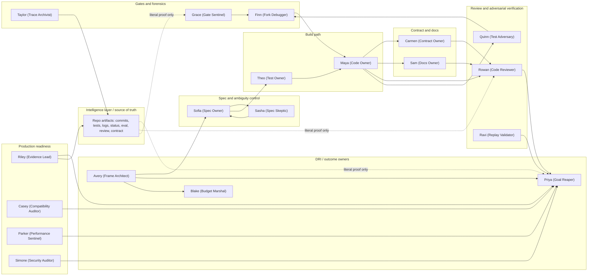

# Pentagon active_graph org chart

This is the intended information flow for the Pentagon workspace.

## How the Pentagon canvas should look

Arrange the canvas as a left-to-right org chart:

1. Outcome owners: Avery, Priya, Blake
2. Spec control: Sofia over Sasha
3. Build path: Theo over Maya
4. Contract/docs: Carmen over Sam
5. Verification: Rowan, Quinn, Ravi
6. Gates/forensics: Grace, Finn, Taylor
7. Production/evidence: Riley, Casey, Parker, Simone

Status cards are not the org chart. They are temporary work notices and should
be ignored when reading responsibility. The org chart is the named agent nodes
and the flow above.
